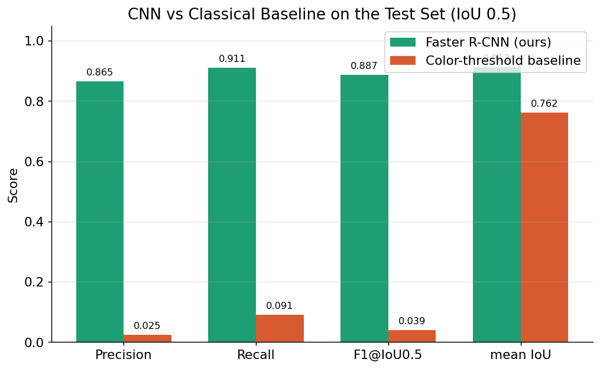
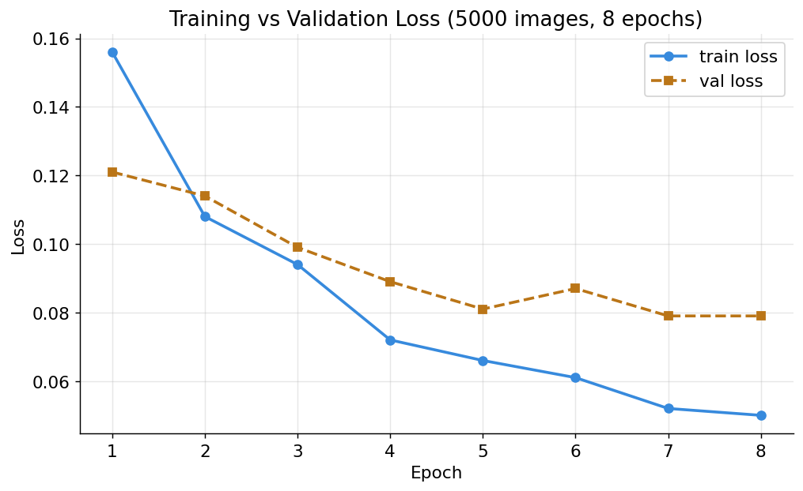
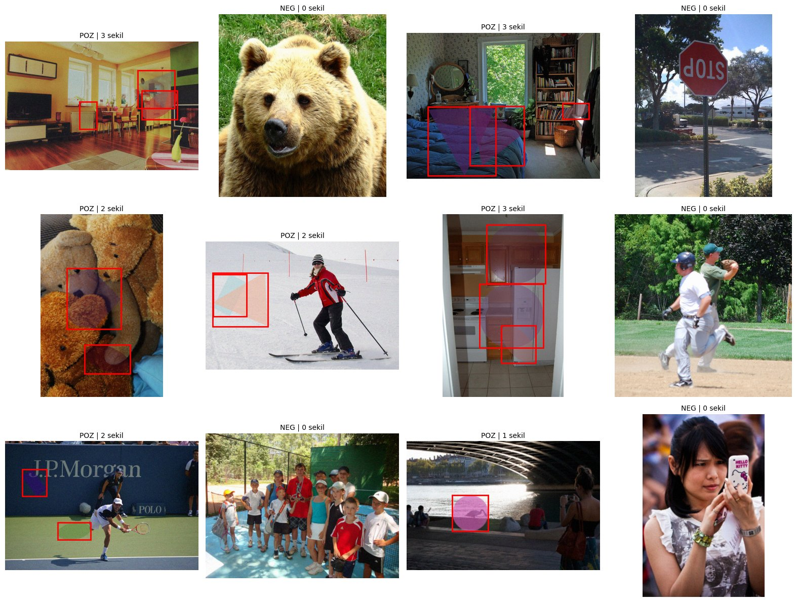
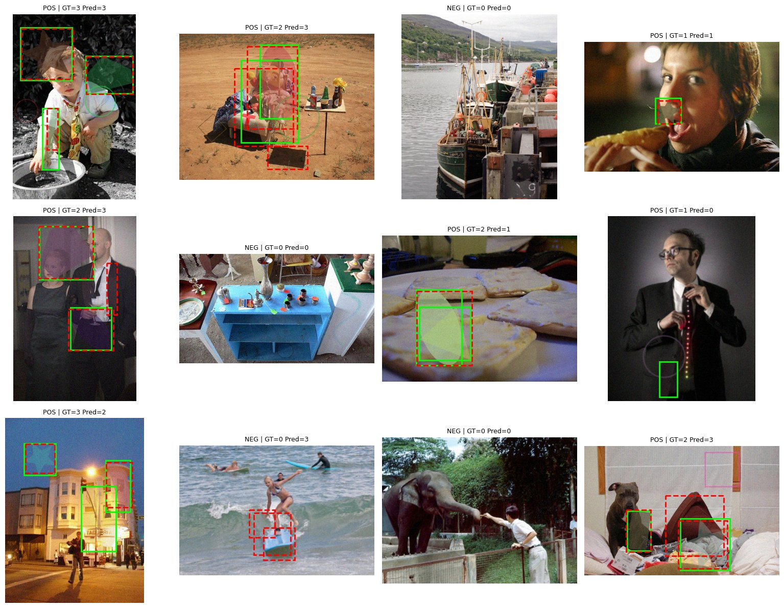
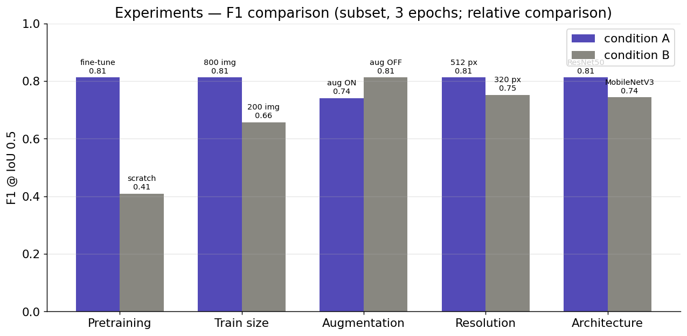

# Synthetic Shape Detection on Natural Images

> CENG428 — Neural Networks · Take-Home Practice Exam
> Detecting and localizing synthetic shapes overlaid on MS COCO 2017 images with a fine-tuned **Faster R-CNN**.


---

## Overview

This project builds a complete object-detection pipeline that finds **synthetic shapes** (circles, rectangles, triangles, ellipses, polygons, line segments, stars) that are programmatically painted onto natural images from **MS COCO 2017**. COCO is used **only as a source of background images** — its original object labels are never used as targets. Every target label (bounding box) is generated automatically and reproducibly from the shape-drawing code.

The pipeline is split into **three notebooks** that communicate through files on disk, so each stage can be run, cleared and shared independently:

1. **`01_data_creation.ipynb`** — generates the dataset and saves it as `synthetic_data.zip`.
2. **`02_model_training.ipynb`** — fine-tunes Faster R-CNN and saves `best_model.pth`.
3. **`03_model_testing.ipynb`** — evaluates on the held-out test set, compares against a classical baseline, visualizes predictions, and runs five controlled experiments.

---

## Headline results (test set, IoU = 0.5)

| Model | Precision | Recall | F1 | mean IoU |
|---|---|---|---|---|
| **Faster R-CNN (ours)** | **0.865** | **0.911** | **0.887** | **0.913** |
| Color-threshold baseline | 0.025 | 0.091 | 0.039 | 0.762 |

The deep model finds ~91% of all shapes with tight boxes (mean IoU 0.91) and beats the classical baseline by **22× on F1** — confirming the task is genuinely non-trivial and not solvable by simple color rules.



---

## Training behaviour

Trained on the required 5,000 images for 8 epochs with horizontal-flip augmentation and a StepLR schedule. Train and validation loss fall together and the validation loss plateaus around 0.079 without diverging — only mild, well-controlled overfitting.



---

## Synthetic data generation

Each background image receives 0–3 shapes (70% positive / 30% negative images). To make the task non-trivial (not solvable by color thresholding), the generator combines **six+ difficulty mechanisms**: random opacity / partial transparency, anti-aliasing (4× supersampling), random Gaussian blur, additive noise, low-contrast colors sampled from local image statistics, random rotation, and unlabeled **distractor** outlines that create hard negatives. Validation/test shapes are fully deterministic via a SHA-256 seed (`make_seed`), so labels reproduce exactly.



---

## Prediction visualizations

Green = ground-truth box, red dashed = model prediction (positive and negative, success and failure cases).



---

## Experiments

Five controlled experiments, each changing a single factor, run on small subsets for fast relative comparison.

| # | Experiment | Condition A | Condition B | F1 (A) | F1 (B) | Δ |
|---|---|---|---|---|---|---|
| 1 | Pretraining | fine-tune | from scratch | 0.812 | 0.409 | **+0.404** |
| 2 | Training-set size | 800 images | 200 images | 0.812 | 0.657 | +0.155 |
| 3 | Data augmentation | aug ON | aug OFF | 0.740 | 0.812 | −0.072 |
| 4 | Input resolution | 512 px | 320 px | 0.812 | 0.751 | +0.061 |
| 5 | Backbone | ResNet-50 | MobileNetV3 | 0.812 | 0.743 | +0.070 |



**Takeaways.** Pretraining is decisive: from scratch, precision collapses to 0.28 because 5,000 images cannot train a backbone from zero. More data raises F1 and precision (less overfitting). Augmentation slightly *hurts* in this 3-epoch subset run because flips slow convergence — but in the full 8-epoch training it was kept ON since it lowered the train–val gap, showing augmentation needs enough epochs to pay off. Higher resolution helps small, low-contrast shapes. ResNet-50 outperforms MobileNetV3 on recall (0.83 vs 0.70), while MobileNetV3 is the faster/lighter option.

---

## Method summary

- **Dataset:** MS COCO 2017 via `torchvision.datasets.CocoDetection`. Split (image IDs in increasing order): first 5,000 of `train2017` → train; first 1,000 of `val2017` → validation; next 1,000 of `val2017` → test. No train/test leakage.
- **Model:** `fasterrcnn_resnet50_fpn`. The backbone + FPN + RPN are **COCO-pretrained**; the box-predictor head is **trained from scratch** for the 2-class problem (background, synthetic shape).
- **Loss:** Faster R-CNN multi-task loss (classifier + box regression + objectness + RPN box regression).
- **Optimizer / schedule:** SGD (lr 0.005, momentum 0.9, weight decay 5e-4) + StepLR(step=3, γ=0.5), 8 epochs, batch size 4, input min-side 512 px.
- **Metrics:** Precision / Recall / F1 at IoU 0.5 and mean IoU of matched predictions.
- **Baseline:** HSV saturation thresholding + connected components (OpenCV).

---

## Repository structure

```
synthetic-shape-detection/
├── README.md
├── requirements.txt
├── LICENSE
├── .gitignore
├── Links.txt                     # public Drive links: dataset zip + trained model
├── notebooks/
│   ├── 01_data_creation.ipynb    # generate data -> synthetic_data.zip
│   ├── 02_model_training.ipynb   # fine-tune Faster R-CNN -> best_model.pth
│   └── 03_model_testing.ipynb    # evaluation + baseline + experiments
└── assets/                       # figures used in this README
    ├── loss_curve.png
    ├── cnn_vs_baseline.png
    ├── experiments.png
    ├── generated_samples.png
    └── test_predictions.png
```

---

## How to run

Designed for **Google Colab with a GPU runtime** (Runtime → Change runtime type → GPU).

1. **Data** — open `notebooks/01_data_creation.ipynb`, *Run all*. It downloads COCO, generates the dataset, writes `synthetic_data.zip`, and uploads it to Google Drive. (Use `SMALL_TEST=True` for a quick dry run; `SMALL_TEST=False` for the full 5,000/1,000/1,000 protocol.)
2. **Train** — open `notebooks/02_model_training.ipynb`, *Run all*. It pulls the dataset from Drive, fine-tunes the model, saves `best_model.pth`, and uploads it to Drive.
3. **Test** — open `notebooks/03_model_testing.ipynb`, *Run all*. It pulls the dataset + model from Drive, reports metrics, draws prediction figures, and runs the experiments.

The COCO dataset and the generated images are **not** stored in this repo. The dataset zip and the trained model are shared via the links in [`Links.txt`](Links.txt).

---

## Reproducibility

- **Seeds:** `GLOBAL_SEED = 2025`. Validation/test shapes are deterministic via `make_seed` (SHA-256, not Python's `hash()`).
- **Environment:** Python 3.10+, PyTorch 2.x, torchvision 0.x (exact versions printed in Notebook 2). Install with `pip install -r requirements.txt`.
- **Outputs:** metrics in `results/metrics.json` and `results/experiments.csv`; figures in `results/figures/`.

---

## Limitations and possible improvements

- Single foreground class (shape vs background); the model does not classify shape type.
- The distractor design is heuristic and may not match real-world image manipulations.
- Only F1@IoU0.5 and mean IoU are reported (mAP not computed).
- The baseline is intentionally weak; a learned shallow-CNN baseline would be a stronger comparison.


